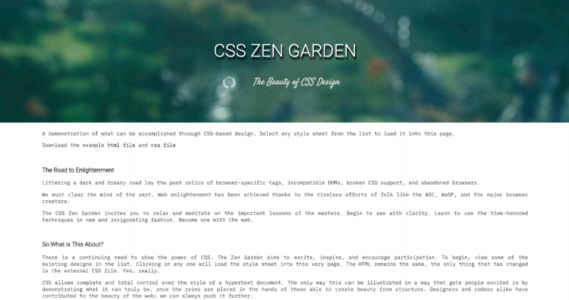
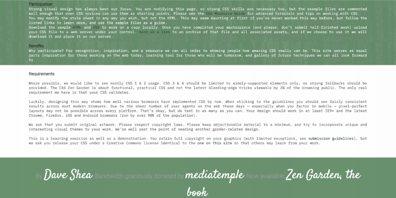
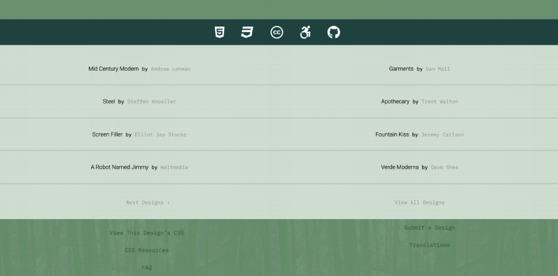

## Zen Garden Task

Use CSS to make the HTML file look like below without changing any HTML and only using the given class names.

When hovering over 'David Shea', 'mediatemple' and 'Zen Garden, the book', the word or phrase should be underlined. When hovering over icons from font awesome, the should turn grey.

